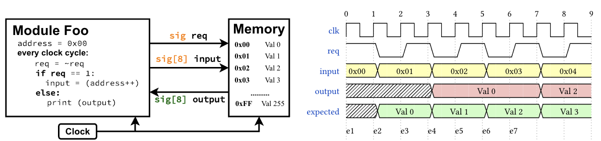

# Motivation

In the previous section, we established the fundamental programming paradigm of HDLs, in which hardware components are modeled as state machines. We also saw that de-facto HDLs such as SystemVerilog provide the low-level constructs needed to describe these state machines, giving designers fine-grained control over hardware behavior. At the end of the section, we identified several questions that arise when interfacing with components written in these HDLs. These questions intuitively highlight the challenge of ensuring that modules exchange values with a shared understanding of timing and validity constraints.

To illustrate this, consider the following example. The `FOO` module sends a read request (`req`) to a memory module and expects a response by reading the `output` signal. For clarity, the HDL code has been desugared into a software-style description. On the right, the waveform diagram shows the observed behavior of the system during simulation.

<div align="center">


</div>

In this example, the `FOO` module sends a read request by setting the `req` signal high and providing an address on the `input` signal. The value of the `input` signal changes in the following cycle. The `FOO` module then expects the memory to respond with the data at the specified address by reading the `output` signal. However, as observed in the simulation waveform, the output data is not as expected. The value corresponding to the requested address becomes available only after two cycles. Furthermore, half of the address translations are skipped.

A closer inspection of the memory module’s implementation reveals the cause of this behavior. The memory module expects the `input` signal to remain stable for two cycles before it can produce the correct output in the next cycle. If the input changes earlier, the memory pauses its operation. As a result, when `FOO` changes the address and deasserts `req` after only one cycle, the memory stops processing the request and resumes only when `req` is asserted again in the next cycle. Consequently, the address `0x00` is translated after three cycles instead of one. Similarly, before the address `0x01` can be processed, the `input` has already changed to `0x02`, causing the translation for `0x01` to be skipped entirely.

This kind of unintended behavior arises because intermediate values change during an ongoing computation. We refer to such problems as **timing hazards**. The root cause of the issue here is the lack of a shared timing contract between the `FOO` module and the memory module. The interface provides no information about how long input signals must remain stable or how long output signals remain valid.

In simple terms, timing violations occur when:

- A component reads a value before it is ready or after it has become invalid.
- A register storing state is overwritten while it is still in use.

Since components exchange values that are sourced from their internal state, such timing violations can lead to incorrect computations, data corruption, and unpredictable system behavior.

These issues motivate the need for:

1. Better abstractions for modeling hardware components and their interfaces.
2. A mechanism to specify and enforce timing contracts between components.

Anvil addresses these challenges by introducing higher-level message-passing abstractions, while still giving designers control over resources such as clock-cycle latency and registers. It allows designers to specify timing contracts directly in component interfaces. To enforce these contracts, Anvil’s type system reasons about the *lifetimes* of all values at compile time. It ensures that values are not used outside their valid lifetimes and that registers are not overwritten while they are still in use.


## Hello World! in Anvil

Now it is time to write our first Anvil program!

```{eval-rst}
.. anvil-playground::
    :playground-url: https://anvil.capstone.kisp-lab.org
    
    proc Top() {
        reg counter : logic[8];
        loop {
            let cnt = *counter + 1;
            dprint"[Cycle %d] Hello World in Anvil!" (*counter) >>
            set counter := *counter + 1
        }
    }
```

In this program, we define a hardware process named `Top` using the `proc` keyword.
The process body begins with the declaration of a register `counter` of type `logic[8]`, which represents an 8-bit-wide register.

Following this declaration, the behavior of the process is defined inside a `loop` construct. This models the fact that hardware processes run indefinitely and are naturally expressed as looping state machines. The loop body describes the behavior of the process in each iteration. In this example, each iteration performs two actions.

The first expression is a `let` binding that creates an intermediate value `cnt`. This value holds the result of incrementing the `counter` register by 1. The `*` operator is used to dereference the value stored in the register. Following this, we have a debug print statement `dprint` that outputs the value of the counter.

The `>>` operator is the *wait* operator. It indicates that the evaluation of the following term proceeds only after the previous term has completed. This operator helps model sequential behavior in hardware processes. The `;` join operator is used to execute multiple expressions in parallel. For instance, ( t_1 ; t_2 ) indicates that both ( t_1 ) and ( t_2 ) execute concurrently, and the combined expression completes when both have finished. This is similar to a fork-join construct in software programming languages.

In this program, the `let` and `dprint` expressions execute concurrently. The loop waits for both to complete before proceeding to the next expression. In this example, both expressions are *immediate*, meaning they complete without consuming any clock cycles. The final expression is the `set` expression, which updates the value of the `counter` register by incrementing it by 1. This update takes one clock cycle to complete. Therefore, the loop iterates once every cycle.

You may have noticed that registers in Anvil are conceptually similar to registers in SystemVerilog. The `let` binding, which creates an intermediate value, is akin to creating a wire in SystemVerilog. Such a value is sourced from some underlying signal or register, and if that source changes in the next cycle, the wire’s value would normally change as well. However, Anvil’s type system prevents this from happening. Once a value like `cnt` is created, it is guaranteed to remain constant for the entire duration of its scope. This guarantee is enforced statically by the type system.

To illustrate this, consider the following modified version of the program:

```{eval-rst}
.. anvil-playground::
    :playground-url: https://anvil.capstone.kisp-lab.org
    
    proc Top() {
        reg counter : logic[8];
        loop {
            let cnt = *counter + 1;
            set counter := *counter + 1 >>
            dprint"[Cycle %d] Hello World in Anvil!" (cnt) >>
            cycle 1
        }
    }
```

Executing this code results in a compile-time error. The reason is that the value `cnt` is used on line 6, but the register `counter` is updated earlier on line 4. This violates timing safety, because `cnt` depends on `counter`. Anvil’s type system detects this error statically and rejects the program.

As a result, all values created using `let` bindings in Anvil are guaranteed to remain constant from the moment they are created until the end of their scope. This provides strong timing safety guarantees at compile time.

